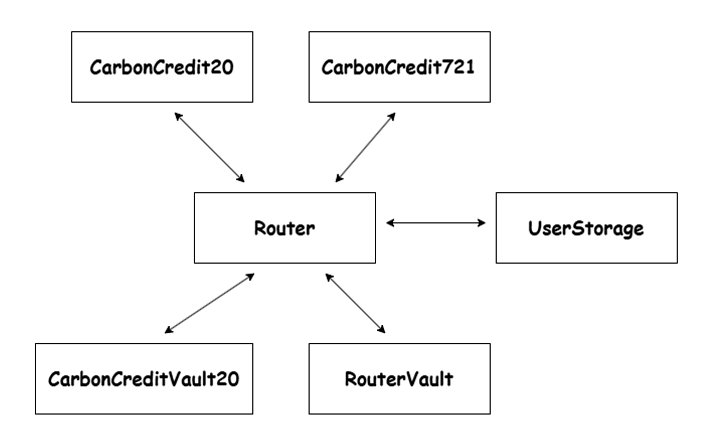

# TheSustainity_Test_DaehwanCho

[LIVE DEMO WEBSITE](https://thesustainitytestdaehwancho.netlify.app/)

## Strucutre



As you can see the above strucutre, there are 5 main smart contracts.

1. **CarbonCredit20** is based on solady's erc20.sol which is the latest gas optimized erc20. This CC20 is to offset the emitted carbon.

2. **CarbonCredit721** is an alternative token to offset emitted carbon by depositing CC20. Each NFT has its own CC20, and when burned, the amount of CC20 in the NFT will be applied to offset the carbon emissions. This is based on erc721A.sol.

3. **Router** is a hub where users can interact with both CarbonCredit20 and CarbonCredit721.

4. **CarbonCredit20Vault** is a vault that receives CC20 when it is burned to offset emitted carbon.

5. **RouterVault** is a vault that receives ETH when CC20 is purchased with ETH by users.

## Gas Optimization

1. Use Gas-Optimized Standard Smart Contracts such as `Solady's ERC20.sol` and `ERC721A`

   - These contracts spend less gas compared to OpenZeppelin's implementations.

2. No extra events(Minted, Burned, Transferred)

   - Only built-in `Transfer` event is used for gas optimization.
   - The standard `Transfer` event has 3 parameters `Transfer(from, to, amount)`.
   - When a token is minted, the `from` is address zero (0x00..00)
   - When a token is burned, the `to` is address zero (0x00..00)
   - This feature can be useful for distinguishing mint and burn events on the front end.

3. Use `external` instead of `public` to function

   - `public functions` can be called both internally and externally, whereas `external functions` can only be called from outside the smart contract. This makes external functions more gas-efficient.
   - `external` functions read directly from calldata, which consumesless gas than public functions read from memory.

4. Use `Direct` Hash Bytes Instead of the `keccak256` Function

   - Using a precomputed hash is more gas-efficient than calling the keccak256 function to hash values on-chain.

5. Use the `unchecked` Keyword When Overflow or Underflow Is Impossible

   - The Solidity 0.8 compiler automatically checks for overflow and underflow, making SafeMath unnecessary.
   - The `unchecked` keyword disables these checks, reducing gas costs when overflow or underflow is not a concern.

6. Figure Out the Optimal Number of Optimizer Runs
   - Increasing the number of optimizer runs reduces gas costs during function execution, but it may incur higher gas costs during contract deployment compared to using fewer runs.

## Maintenance

Gas optimization is important, but so is maintainability. Since blockchain is immutable, a deployed smart contract cannot be changed even if it has bugs or security issues. In such cases, a proxy contract can help, though it costs a bit more than a regular smart contract.

## Requirements

- [Node](https://nodejs.org/en/download/)
- [Git](https://git-scm.com/downloads)

### Built with:

- [Next.js](https://nextjs.org)
- [typescript](http://typescript.com/)
- [expressJs](https://expressjs.com/)
- [Hardhat](https://hardhat.org)
- [Ethers.js](https://docs.ethers.io/v6/)
- [Reown](https://reown.com/)
- [Alchemy](https://www.alchemy.com/)
- [Node](https://nodejs.org/en/download/)
- [Git](https://git-scm.com/downloads)
- Linting with [ESLint](https://eslint.org)
- Formatting with [Prettier](https://prettier.io)

## Quick start

### 1. Smart contract & Website

1. **Clone the repository and install all dependencies**

   ```bash
   git clone https://github.com/hsjo12/thesustainity_test_daehwan_cho.git
   cd smartContract

   npm install
   ```

2. **Deploy smart contracts on Sepolia testnet**

   In order to deploy contract you will need:

   2-1. Ensure you have the following prerequisites:

   - $ETH on Ethereum Sepolia testnet.
   - Ethereum Sepolia testnet RPC endpoint.

   2-2. **Create a `.env` file in the smartContract folder with the following content:**

   - To get a RPC : https://auth.alchemy.com/

   ```env
   PK="Deployer private key"
   RPC_URL="Alchemy RPC"
   ```

   2-3. **Deploy smart contracts on Sepolia testnet**

   ```bash
   npx hardhat run scripts/deploy.ts --network eth_sepolia
   ```

   2-4 **Check if the abis folder is generated in the smartContract folder for the website setting**

3. **Go to website folder and install all dependencies**

   ```bash
   cd ..
   cd website

   npm install
   ```

4. **Copy and Past the abis folrder from the smart contract to the website folder**

5. **Create a `.env` file in the smartContract folder with the following content:**

   - To generate a REOWN project id : https://cloud.reown.com/sign-in
   - To get a RPC : https://auth.alchemy.com/

   ```env
   NEXT_PUBLIC_REOWN_PROJECT_ID="REOWN project id"
   NEXT_PUBLIC_RPC="Alchemy RPC"
   NEXT_PUBLIC_STARTING_BLOCK="Deployed block number or latest block number"
   ```

6. **Build website**

   ```bash
   npm run build
   ```

7. **Start website**

   ```bash
   npm run start
   ```

### 2. BackendAPI

1. **Copy and past the abis folder from the smart contract folder to backendAPI folder**

2. **Create a `.env` file in the backendAPI folder with the following content:**
   - To get a RPC : https://auth.alchemy.com/
   ```env
   PK="Deployer private key"
   RPC_URL="Alchemy RPC"
   ```

## Play smart contracts using hardhat scripts instead of restful API

1. **Go to smartContract folder**

2. **See the `scripts/functions/cc20` and `scripts/functions/cc721`**
   Each directory has scripts interacting with smart contract

   ### CC20 (ERC20)

   1. Mint Tokens (scripts/functions/cc20/mintCC20.ts)

      - Set up the variable `TO` for the recipient's address.
      - Set the variable `AMOUNT` for the number of tokens to mint.

      ```bash
      npx hardhat run scripts/functions/cc20/mintCC20.tsx --network eth_sepolia
      ```

   2. Burn Tokens (scripts/functions/cc20/burnCC20.ts)

      - Set the variable `AMOUNT` for the number of tokens to burn.

      ```bash
      npx hardhat run scripts/functions/cc20/burnCC20.tsx --network eth_sepolia
      ```

   3. Transfer Tokens (scripts/functions/cc20/transferCC20.ts)

      - Set up the variable `TO` for the recipient's address.
      - Set the variable `AMOUNT` for the number of tokens to transfer.

      ```bash
      npx hardhat run scripts/functions/cc20/transferCC20.tsx --network eth_sepolia
      ```

   4. Balance (scripts/functions/cc20/balanceCC20.ts)

      - Set up the variable `TO` for the recipient's address.

      ```bash
      npx hardhat run scripts/functions/cc20/balanceCC20.tsx --network eth_sepolia
      ```

   5. Grant Manager Role (scripts/functions/cc20/grantManagerRole.ts)

      - This script grants a user the manager role, allowing them to mint.
      - Set up the variable `TO` for the recipient's address.

      ```bash
      npx hardhat run scripts/functions/cc20/grantManagerRole.tsx --network eth_sepolia
      ```

   ### CC721 (ERC721)

   1. Mint Tokens (scripts/functions/cc721/mintCC721.ts)

      - Set up the variable `TO` for the recipient's address.
      - Set the variable `AMOUNT` for the number of tokens to deposit to mint CC721.

      ```bash
      npx hardhat run scripts/functions/cc721/mintCC721.tsx --network eth_sepolia
      ```

   2. Burn Tokens (scripts/functions/cc721/burnCC721.ts)

      ```bash
      npx hardhat run scripts/functions/cc721/burnCC721.tsx --network eth_sepolia
      ```

   3. Transfer Tokens (scripts/functions/cc721/transferCC721.ts)

      - Set up the variable `TO` for the recipient's address.

      ```bash
      npx hardhat run scripts/functions/cc721/transferCC721.tsx --network eth_sepolia
      ```

   4. Balance (scripts/functions/cc721/balanceCC721.ts)

      - Set up the variable `TO` for the recipient's address.

      ```bash
      npx hardhat run scripts/functions/cc721/balanceCC721.tsx --network eth_sepolia
      ```

## Play smart contracts with restful API

1. **Go to the backendAPI folder**

   ```bash
   cd backendAPI

   npm run start
   ```

2. **GET/POST request to http://localhost:3001**

   ### Restful API for CC20 (ERC20)

   1. Mint Tokens

      - Set up the variable `recipient` for the recipient's address.
      - Set the variable `amount` for the number of tokens to mint.
      - `amount` unit is wei

        ```bash
        curl -X POST http://localhost:3001/mint \
           -H "Content-Type: application/json" \
           -d '{
             "recipient": "0x1234...",
             "amount": 1000000000000000000
           }'
        ```

   2. Burn Tokens

      - Set the variable `AMOUNT` for the number of tokens to burn.
      - `amount` unit is wei

        ```bash
         curl -X POST http://localhost:3001/burn \
           -H "Content-Type: application/json" \
           -d '{
             "amount": 1000000000000000000
           }'
        ```

   3. Transfer Tokens

      - Set up the variable `recipient` for the recipient's address.
      - Set the variable `AMOUNT` for the number of tokens to transfer.
      - `amount` unit is wei

        ```bash
        curl -X POST http://localhost:3001/mint \
           -H "Content-Type: application/json" \
           -d '{
             "recipient": "0x1234...",
             "amount": 1000000000000000000
           }'
        ```

   4. Balance

      - Set up the variable `/balance/:address` for the recipient's address.

        ```bash
        curl -X GET http://localhost:3001/balance/0x1234...
        ```

   ### CC721 (ERC721)

   1. Mint Tokens

      - Set up the variable `recipient` for the recipient's address.
      - Set the variable `depositAmount` for the number of CC20 tokens to deposit to mint a CC721 NFTs.
      - `amount` unit is wei

        ```bash
        curl -X POST http://localhost:3001/nft/mint \
           -H "Content-Type: application/json" \
           -d '{
             "recipient": "0x1234...",
             "depositAmount": 1000000000000000000
           }'
        ```

   2. Burn Tokens

      - Set the variable `id` for the token id to burn.

        ```bash
         curl -X POST http://localhost:3001/nft/burn \
           -H "Content-Type: application/json" \
           -d '{
             "id": 0
           }'
        ```

   3. Transfer Tokens

      - Set up the variable `recipient` for the recipient's address.
      - Set the variable `id` for the token id to burn.

        ```bash
        curl -X POST http://localhost:3001/nft/mint \
           -H "Content-Type: application/json" \
           -d '{
             "recipient": "0x1234...",
             "id": 0
           }'
        ```

   4. Balance

      - Set up the variable `/nft/balance/:address` for the recipient's address.

        ```bash
        curl -X GET http://localhost:3001/nft/balance/0x1234...
        ```

## Test Smart contracts

```bash
cd smartContract

npx hardhat test
```

## Generate test coverage

```bash
cd smartContract

npx hardhat coverage
```

## Deployment Addresses

### Sepolia

| Name                  | Address                                    |
| --------------------- | ------------------------------------------ |
| `CarbonCredit20`      | 0x290F4244dd93234045bAdAEE40120fb2ebbA0cc1 |
| `CarbonCredit721`     | 0x32fd0FC45142bECaF72200df149d24C6623A8CCE |
| `Router`              | 0x7a6267937841eFD044b97a77F19C03302Ef2b827 |
| `UserStorage`         | 0xFDeaED448134C1456CF7a797Cb8D82850eE44f8C |
| `CarbonCredit20Vault` | 0xc8786dA63567290302c27382700041e6be1B8E99 |
| `RouterVault`         | 0x11E028ACE918499F76783F79D2ebDbE27E2BfEA9 |
